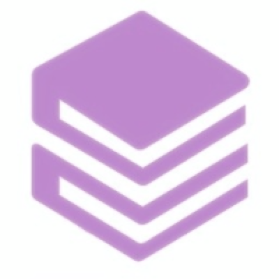
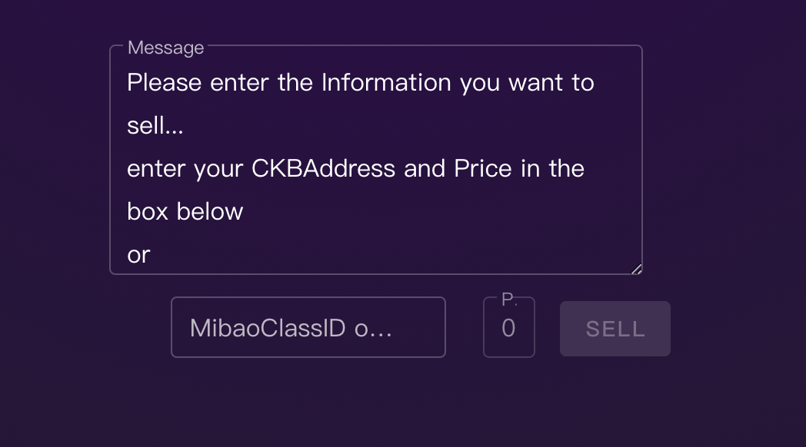

<!-- PROJECT LOGO -->
 

  

  <h3 align="center">Nolay Reading</h3>

  

    Knowledge Paid Components by Nervos NFT
     
    <a href="http://101.200.91.26"><strong>Just Try it!</strong></a>
     
     
    <a href="https://github.com/nolaytech/nolay_web">Explore the docs »</a>
    ·
    <a href="https://github.com/nolaytech/nolay_web/issues">Report Bug</a>
    ·
    <a href="https://github.com/nolaytech/nolay_web/issues">Request Feature</a>
  

<!-- TABLE OF CONTENTS -->

  
Table of Contents

  <ol>
    <li>
      <a href="#about-the-project">About The Project</a>
      <ul>
        <li><a href="#built-with">Built With</a></li>
      </ul>
    </li>
    <li>
      <a href="#getting-started">Getting Started</a>
    </li>
    <li><a href="#usage">Usage</a></li>
    <li><a href="#contact">Contact</a></li>
  </ol>

<!-- ABOUT THE PROJECT -->

## About The Project

NolayReading is a knowledge paid components for pay-per-view.

Unlike traditional pay-for-content, NolayReading is more focus on `Decentralisation`.

`Defi for Reading`,`Promotions`...

 More interesting features will be updated later

### Built With

- [Nervos](https://www.nervos.org/)
- [Mibao](https://mibao.net/)
- [UniPass](https://unipass.xyz/)

<!-- GETTING STARTED -->

## Getting Started

You can Buy content or Sell your knowledge as below step.

### Buy

if you find out any website used NolayReading to sell content like [this](https://pandatea.life/post/nolayreading-xiao-ji-hua)

[![Product Name Screen Shot][product-screenshot]](https://pandatea.life/post/nolayreading-xiao-ji-hua)

Just Click It!

As long as you have the Specific NFT, the cipher will be decrypted.

### [Sell](http://101.200.91.26)

If you want to sell some content or knowledge..
just open [nolay.tech](http://101.200.91.26)

- input `Knowledge` in the big text field
- input your `ckb address` && `price` in small text field below.
- click `Sell` Button.

After a few moments, you will get the `cipher code` of knowledge.

Copy the `cipher code` into your website
or wherever you can insert the html.

And you're done!

<!-- CONTACT -->

## Contact

PandaTea - [Telegram](https://t.me/NvRVDGzkRJJn)

PandaTea Blog - [Blog](https://pandatea.life)

Project Link: [https://github.com/nolaytech/nolay_web](https://github.com/nolaytech/nolay_web)

<!-- MARKDOWN LINKS & IMAGES -->
<!-- https://www.markdownguide.org/basic-syntax/#reference-style-links -->

[contributors-shield]: https://img.shields.io/github/contributors/othneildrew/Best-README-Template.svg?style=for-the-badge
[contributors-url]: https://github.com/nolaytech/nolay_web/graphs/contributors
[forks-shield]: https://img.shields.io/github/forks/othneildrew/Best-README-Template.svg?style=for-the-badge
[stars-shield]: https://img.shields.io/github/stars/othneildrew/Best-README-Template.svg?style=for-the-badge
[stars-url]: https://github.com/nolaytech/nolay_web/stargazers
[issues-shield]: https://img.shields.io/github/issues/othneildrew/Best-README-Template.svg?style=for-the-badge
[issues-url]: https://github.com/nolaytech/nolay_web/issues
[license-shield]: https://img.shields.io/github/license/othneildrew/Best-README-Template.svg?style=for-the-badge
[license-url]: https://github.com/othneildrew/Best-README-Template/blob/master/LICENSE.txt
[linkedin-shield]: https://img.shields.io/badge/-LinkedIn-black.svg?style=for-the-badge&logo=linkedin&colorB=555
[linkedin-url]: https://linkedin.com/in/othneildrew
[product-screenshot]: images/screenshot.jpeg